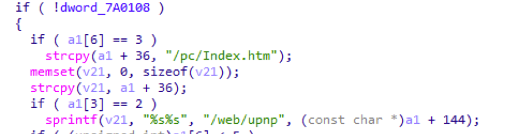
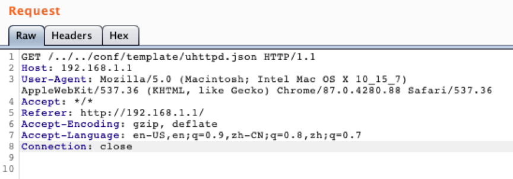
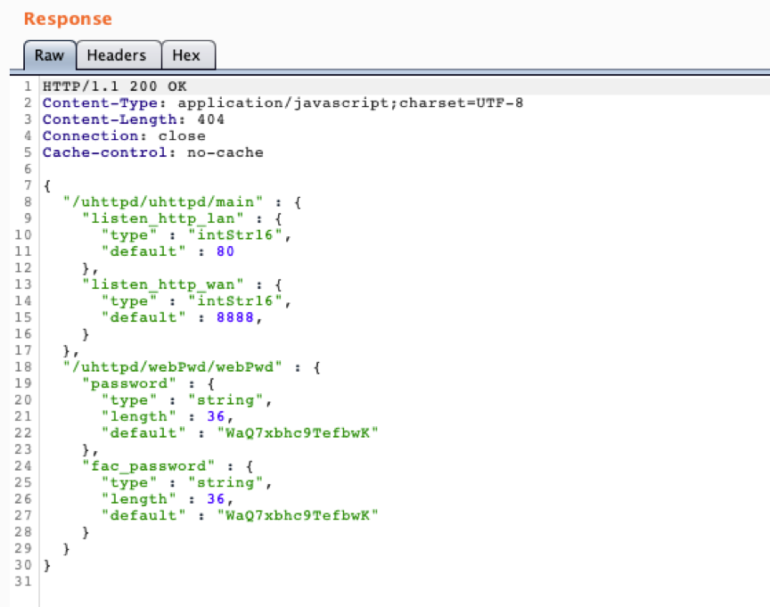

## Background

X18G is the latest wifi6 router from MERCUSYS Technologies, supports dual-band concurrent. Both 2.4GHz and 5GHz dual-band support the new generation Wi-Fi 6 protocol, with a wireless rate of up to 1775Mbps; it also supports 1024QAM Modulation technology, compared with Wi-Fi 5 (802.11ac) 256QAM modulation technology, can transmit more data per unit time, and the rate is significantly improved.

## Description

The router's upnp server does not filter the characters such as "../" in the url. Attackers can use these vulnerabilities to read arbitrary files on the router.

The upnp server will directly splice the requested URL with "/web/upnp" to form the absolute path of the requested resource

## Affect Versions

Device: X18G

Firmware version: 1.0.5

## POC
Use "../" to construct directory traversal. Construct the Http Get request as follows:

Get the router configuration file without authorization

## Acknowledgements
reporter: Dongxiang Ke and Lewei Qu

## References
https://www.mercusys.com/en/
https://www.mercurycom.com.cn/product-521-1.html