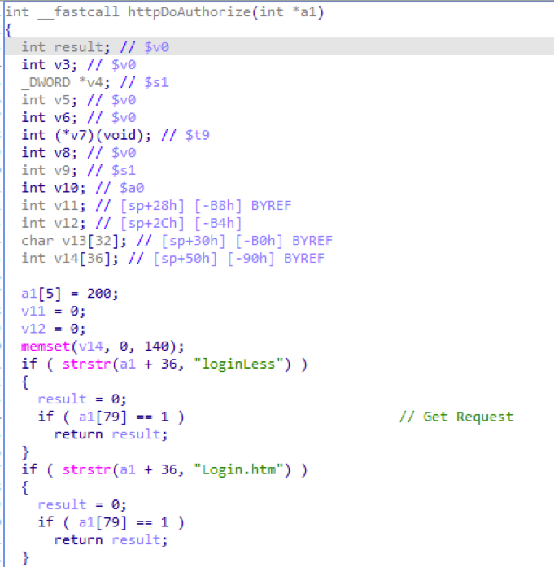
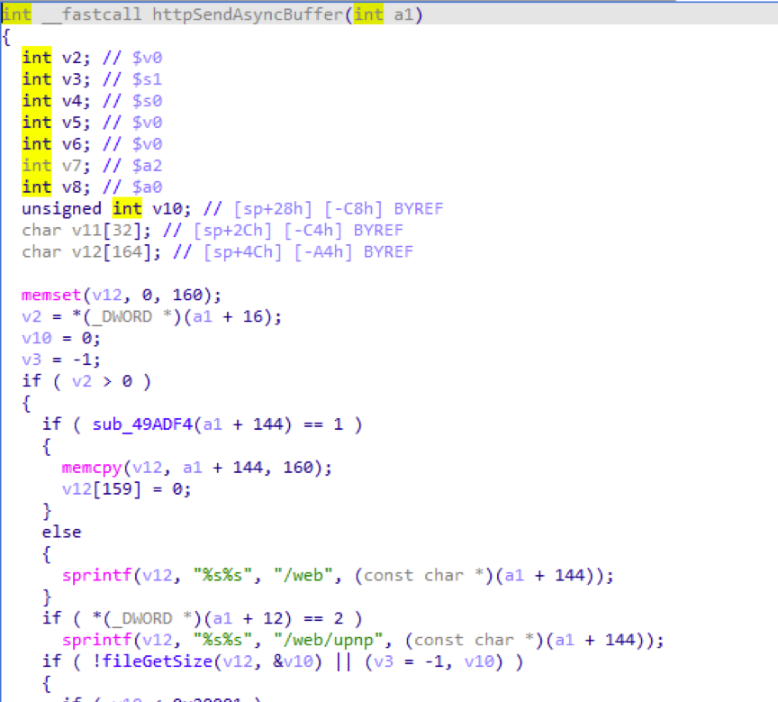
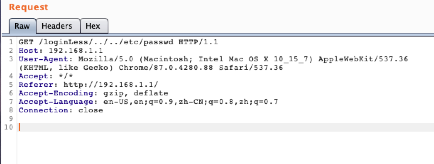
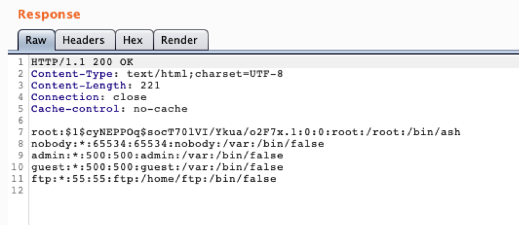

## Background

X18G is the latest wifi6 router from MERCUSYS Technologies, supports dual-band concurrent. Both 2.4GHz and 5GHz dual-band support the new generation Wi-Fi 6 protocol, with a wireless rate of up to 1775Mbps; it also supports 1024QAM Modulation technology, compared with Wi-Fi 5 (802.11ac) 256QAM modulation technology, can transmit more data per unit time, and the rate is significantly improved.

## Description

The router's web server does not strictly authenticate Http requests，and the web server does not filter the characters such as "../" in the url. Attackers can use these vulnerabilities to read arbitrary files on the router without using any cookies and sessions.

1. If the requested url contains "loginLess" or "login.htm", the web server will not authenticate the request

2. After the authentication is completed, the web server will directly splice the requested URL with "/web" to form the absolute path of the requested resource, and will not perform any check on the requested URL

## Affect Versions

Device: X18G

Firmware version: 1.0.5

## POC
Use "../" to construct directory traversal, cooperate with the "loginLess" directory to bypass the http authentication verification.

Construct the Http Get request as follows:

Without logging in to the web server, you can read the router's /etc/passwd file without using any cookies and sessions

## Acknowledgements
reporter: Dongxiang Ke and Lewei Qu

## References
https://www.mercusys.com/en/
https://www.mercurycom.com.cn/product-521-1.html